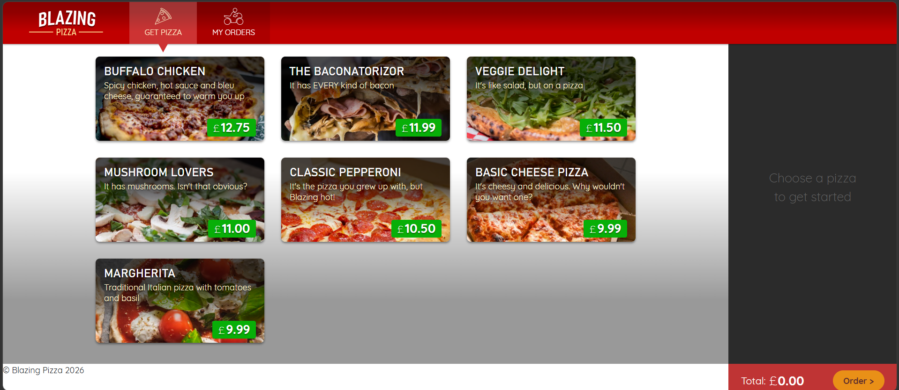
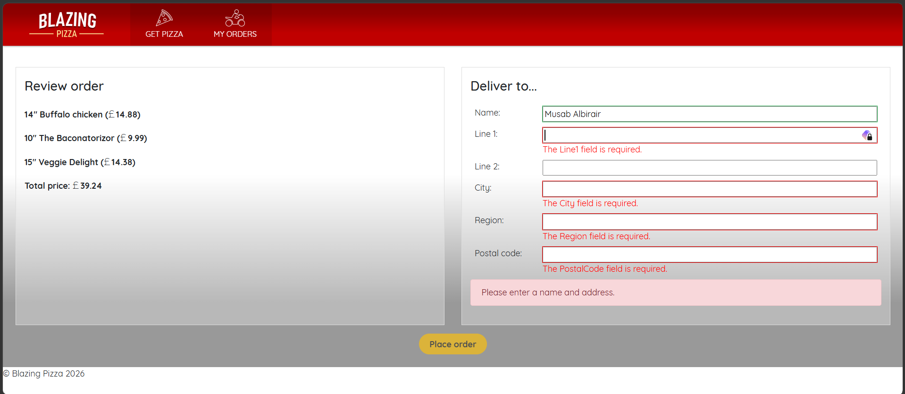

# Blazing Pizza

## Disclaimer

This project is based on 3 modules of the learning path
[Build web apps with Blazor](https://learn.microsoft.com/en-us/training/paths/build-web-apps-with-blazor/).
The [Author](https://www.linkedin.com/in/musab-albirair/) took the liberty to
make small deviations from the instructions provided on Microsoft Learn platform
for educational purposes and to adapt the project to .NET 10 / C# 14. Feel free
to check the repository and use it in any way you see fit.

## Screenshots

### Home

### Pizza Configuration

### Checkout

### Orders List

### Orders Details

